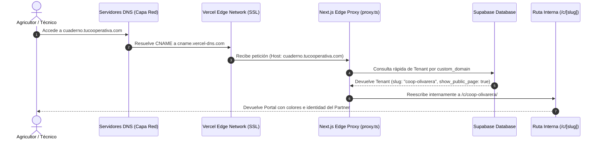

# 🌐 Guía Técnica de Infraestructura DNS y Multi-tenancy Dinámico

Esta guía proporciona las instrucciones paso a paso para configurar la infraestructura de red, DNS y certificados SSL en producción para **InagroSolutions**. 

El sistema de marca blanca permite que múltiples partners (cooperativas, asesorías, etc.) accedan a su propio portal personalizado a través de:
1. **Subdominios dinámicos** de la plataforma (ej. `cooperativa.inagrosolutions.com`).
2. **Dominios o subdominios personalizados** propios (ej. `cuaderno.tucooperativa.com`).

---

## 🏗️ Arquitectura de Enrutamiento y Multi-tenancy

El enrutamiento dinámico se realiza en la capa del Edge utilizando el proxy nativo de Next.js (`src/proxy.ts`). Esto permite resoluciones en milisegundos sin penalizar la latencia ni requerir servidores proxy inversos dedicados.



---

## 📡 1. Configuración de DNS Wildcard (`*.inagrosolutions.com`)

Para habilitar subdominios ilimitados y dinámicos para los partners bajo el dominio principal de la plataforma, es necesario configurar un **DNS Wildcard**.

### Paso 1: Configurar en tu Proveedor de Dominio (ej. Nominalia, GoDaddy, Cloudflare)
Accede a la zona DNS de `inagrosolutions.com` y crea el siguiente registro:

| Tipo | Nombre / Host | Valor / Destino | TTL |
| :--- | :--- | :--- | :--- |
| **CNAME** | `*` | `cname.vercel-dns.com.` | Auto / 1 hora |

> [!IMPORTANT]
> El punto final en `cname.vercel-dns.com.` es obligatorio en algunos proveedores de DNS tradicionales (BIND/FQDN). Si tu proveedor no lo permite, omítelo.

### Paso 2: Registrar el Wildcard en Vercel
En la consola de Vercel del proyecto de InagroSolutions:
1. Ve a **Settings** > **Domains**.
2. Añade un nuevo dominio: `*.inagrosolutions.com`.
3. Vercel solicitará una validación de propiedad TXT si el dominio principal no está gestionado por ellos. Añade el registro TXT indicado en tu proveedor DNS.
4. Una vez validado, Vercel generará automáticamente un certificado SSL wildcard que cubrirá cualquier subdominio dinámico como `cooperativa.inagrosolutions.com`.

---

## 🔌 2. Dominios Personalizados para Partners (ej. `cuaderno.coop.com`)

Cuando una cooperativa o partner prefiere utilizar su propio dominio corporativo para acceder a su portal de marca blanca, el flujo requiere dos pasos de configuración: uno por parte del partner (DNS) y otro por parte de nuestra plataforma (API de Vercel).

### A. Configuración DNS (Por el Partner/Cooperativa)
El partner debe acceder a su panel de gestión de dominio y configurar un registro que apunte a nuestros servidores.

#### Opción 1: Subdominio (Recomendado y más común)
Ejemplo: `cuaderno.tucooperativa.com`

| Tipo | Nombre / Host | Valor / Destino |
| :--- | :--- | :--- |
| **CNAME** | `cuaderno` | `cname.vercel-dns.com.` |

#### Opción 2: Dominio Raíz (Apex Domain)
Ejemplo: `cuadernocooperativa.com`

| Tipo | Nombre / Host | Valor / Destino |
| :--- | :--- | :--- |
| **A** | `@` | `76.76.21.21` (IP de Vercel Anycast) |

---

### B. Registro de Dominio en Vercel (Por la Plataforma)
Aunque el partner configure su CNAME correctamente, Vercel rechazará las conexiones de ese dominio a menos que el dominio esté expresamente registrado dentro de nuestro proyecto. 

Para lograr esto de forma dinámica y desasistida, hemos automatizado la comunicación con la **Vercel Domains API** cuando el administrador guarda su dominio en la sección de marcas.

#### Flujo de Integración API:
1. El partner escribe su dominio en `/admin/branding` y pulsa **Guardar**.
2. El frontend invoca de forma segura a nuestro endpoint `/api/admin/domains` con la acción `add` y el dominio.
3. El backend realiza una llamada HTTP autorizada a Vercel para asociar el dominio a nuestro proyecto:
   ```bash
   POST https://api.vercel.com/v9/projects/${VERCEL_PROJECT_ID}/domains
   Headers:
     Authorization: Bearer ${VERCEL_TOKEN}
   Content-Type: application/json
   Body:
     { "name": "cuaderno.tucooperativa.com" }
   ```
4. Vercel aprovisiona el dominio en su red perimetral mundial e inicia la validación y emisión automática de certificados SSL gratuitos de **Let's Encrypt**.
5. Si el partner ya configuró su registro CNAME, el SSL se activará y estará en línea en un par de minutos. Si aún no lo ha configurado, Vercel quedará esperando la propagación de las DNS.

---

## 🔐 3. Requisitos y Variables de Entorno en Producción

Para que la automatización de dominios personalizados funcione sin intervención manual en el servidor, deben añadirse las siguientes variables de entorno en el panel de producción (Vercel/AWS/Render):

```env
# Token de acceso personal o de equipo de Vercel (generado en Settings > Tokens)
VERCEL_TOKEN="tu_token_de_acceso_seguro_aqui"

# ID del proyecto en Vercel (se encuentra en settings del proyecto o ejecutando `vercel project info`)
VERCEL_PROJECT_ID="prj_xxxxxxxxxxxxxxxxxxxxxxxx"

# (Opcional) Si tu proyecto está bajo una cuenta de Equipo en Vercel, es obligatorio incluir su ID
VERCEL_TEAM_ID="team_xxxxxxxxxxxxxxxxxxxxxxxx"
```

> [!WARNING]
> Nunca expongas `VERCEL_TOKEN` en el frontend. Todas las llamadas a la API de Vercel deben realizarse de forma segura en el servidor a través de endpoints de API protegidos con autenticación y RLS de Supabase.

---

## 🛠️ Diagnóstico y Resolución de Problemas

### 1. El dominio personalizado muestra un error de certificado SSL no seguro
*   **Causa**: Las DNS se configuraron después de haber agregado el dominio a Vercel, o la propagación está tardando más de lo habitual.
*   **Solución**: Vercel reintenta automáticamente la verificación SSL. No obstante, se puede forzar la verificación haciendo una llamada de tipo `PATCH` o eliminando y volviendo a agregar el dominio en el panel de marca blanca.

### 2. Conflicto de Dominio Duplicado (`domain_already_in_use`)
*   **Causa**: El dominio introducido ya está asociado a otro proyecto de Vercel (quizá en otra cuenta o un entorno anterior).
*   **Solución**: El dominio debe eliminarse de la otra cuenta o proyecto de Vercel antes de poder asociarlo a InagroSolutions.
