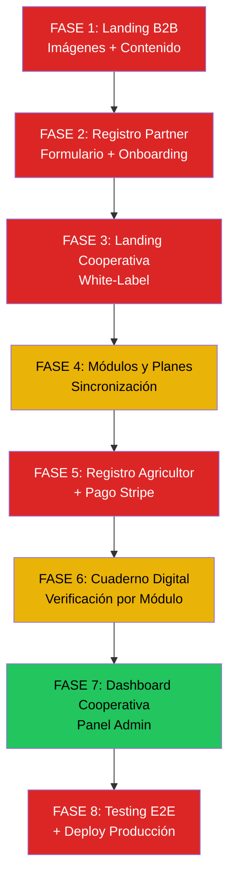

# 🚀 Plan Maestro — InagroSolutions

> **Objetivo**: Llevar la plataforma de estado actual a producción completa, con todo funcionando end-to-end: desde que una entidad descubre InagroSolutions, hasta que un agricultor paga su plan y gestiona su Cuaderno Digital.

---

## Resumen del Estado Actual

| Área | Estado | Notas |
|---|---|---|
| Landing B2B (`page.tsx`) | ✅ Contenido y estructura listos | Faltan imágenes reales / generadas de calidad |
| Formulario Registro Partner (`/signup`) | ✅ Funcional | Falta conexión con Stripe Connect Onboarding |
| Landing Cooperativa (`/c/[slug]`) | ✅ Estructura base | Imagen de dashboard rota, contenido genérico |
| Página de Planes (`/cuaderno/planes`) | ✅ Funcional | Enlace desde cooperativa OK |
| Registro Agricultor (`/signup?role=farmer`) | ✅ Funcional | Falta integración tenant context en signup |
| Onboarding Agricultor (`/onboarding`) | ✅ Wizard 4 pasos | Falta trigger automático post-signup |
| Stripe Checkout (`/api/stripe/checkout`) | ✅ API Route existe | Falta Stripe Connect (Direct Charges) |
| Stripe Webhook (`/api/stripe/webhook`) | ✅ Existe | Falta lógica completa de activación |
| Cuaderno Digital (`/cuaderno`) | ✅ 25 componentes | Módulos funcionales parcialmente |
| Suscripción interna (`/cuaderno/suscripcion`) | ✅ Existe | Funcional |
| Dashboard Tenant (`/dashboard`) | ✅ Base implementada | Falta data real |
| Panel Admin Tenant (`/admin/*`) | ✅ 12 subsecciones | Parcialmente funcional |
| DB Supabase | ✅ 44 tablas con RLS | Completa |

---

## 📋 Fases de Implementación

---

### FASE 1: Landing Page Principal B2B — Imágenes y Contenido Final
> **Prioridad**: 🔴 ALTA — Es la primera impresión para los partners

| # | Tarea | Archivos | Estado |
|---|---|---|---|
| 1.1 | **Generar imagen hero** de alta calidad (campo agrícola tecnificado al atardecer con drones/sensores) para sustituir `olivar_tradicional.png` | `public/images/` | ✅ Completado |
| 1.2 | **Generar imagen** de agricultor usando app móvil en el campo (para sección "Tu negocio en automático") sustituir `agricultor_app.png` | `public/images/` | ✅ Completado |
| 1.3 | **Generar imagen** de equipo de cooperativa trabajando (para sección "Control total sobre tus asociados") sustituir `agricultores_trabajando.png` | `public/images/` | ✅ Completado |
| 1.4 | **Generar mockup de dashboard** profesional de la plataforma (para sustituir `dashboard_mockup.png`) | `public/images/` | ✅ Completado |
| 1.5 | **Revisar y pulir copys** de la landing: subtítulos, CTAs, FAQs, datos de negocio | `src/app/page.tsx` | ✅ Completado |
| 1.6 | **Añadir sección de testimonios / social proof** (logos de cooperativas ficticios o reales) | `src/app/page.tsx` | ✅ Completado |
| 1.7 | **Añadir animaciones de scroll** (fade-in en secciones al hacer scroll) | `src/app/page.tsx`, `globals.css` | ✅ Completado |
| 1.8 | **Verificar responsive completo** (móvil, tablet, desktop) | `src/app/page.tsx` | ✅ Completado |

**Criterio de aceptación**: La landing se ve espectacular con imágenes reales/generadas, todos los textos son definitivos, las animaciones funcionan y es 100% responsive.

---

### FASE 2: Registro de Entidades / Cooperativas (Partner Signup)
> **Prioridad**: 🔴 ALTA — Es el funnel de conversión B2B

| # | Tarea | Archivos | Estado |
|---|---|---|---|
| 2.1 | **Ampliar formulario de registro Partner** con campos: CIF, dirección, teléfono de contacto, provincia, nº estimado de socios | `src/app/(auth)/signup/page.tsx` | ✅ Completado |
| 2.2 | **Crear flujo post-registro Partner**: tras confirmar email → onboarding de entidad (subir logo, color, slug personalizado) | `src/app/(protected)/onboarding/` | ✅ Completado |
| 2.3 | **Auto-crear tenant** en Supabase al registrar un partner (trigger DB o server action) | `src/lib/actions/cooperative.ts`, DB trigger | ✅ Completado |
| 2.4 | **Página de éxito post-registro** con instrucciones claras ("Confirma tu email y accede a tu panel") | `src/app/(auth)/signup/success/page.tsx` | ✅ Completado |
| 2.5 | **Conectar Stripe Connect Express Onboarding** para que el partner configure sus datos de pago/cobro | `src/app/api/stripe/connect/`, `src/app/(protected)/admin/billing/` | ✅ Completado |

**Criterio de aceptación**: Un partner puede registrarse, confirmar email, configurar su marca (logo+colores+slug), y activar Stripe Connect para recibir comisiones.

---

### FASE 3: Landing Pages de Cooperativas (White-Label)
> **Prioridad**: 🔴 ALTA — Es la puerta de entrada del agricultor

| # | Tarea | Archivos | Estado |
|---|---|---|---|
| 3.1 | **Generar imagen hero genérica** para las landing de cooperativas (`/public/images/hero_cooperativa_v2.png`) usando IA | `public/images/` | ✅ Completado |
| 3.2 | **Corregir imagen del dashboard** rota en la sección "Más que una app" (actualmente apunta a ruta de brain/) | `src/app/c/[slug]/page.tsx` L172 | ✅ Completado |
| 3.3 | **Generar imagen de dashboard agrícola** para sustituir la referencia rota | `public/images/` | ✅ Completado |
| 3.4 | **Añadir sección de testimonios dinámicos** por tenant (usa tabla `site_testimonials`) | `src/app/c/[slug]/page.tsx` | ✅ Completado |
| 3.5 | **Implementar hero_subtitle personalizable** y más campos de contenido del tenant (tabla `tenants`) | `src/app/c/[slug]/page.tsx`, DB migration | ✅ Completado |
| 3.6 | **Añadir animaciones de scroll** consistentes con la landing principal | `src/app/c/[slug]/page.tsx` | ✅ Completado |
| 3.7 | **Verificar que los CTAs de "Ver Planes"** llevan correctamente a la página de planes con el tenant context | `src/app/c/[slug]/page.tsx` | ✅ OK |
| 3.8 | **Añadir sección FAQ** dinámica por cooperativa | `src/app/c/[slug]/page.tsx` | ✅ Completado |

**Criterio de aceptación**: La landing de cualquier cooperativa se ve profesional con la marca del tenant, imágenes de calidad, contenido personalizable, y todos los CTAs redirigen correctamente al flujo de selección de plan → registro → pago.

---

### FASE 4: Módulos y Planes del Cuaderno Digital
> **Prioridad**: 🟡 MEDIA — La estructura ya existe, hay que refinar

| # | Tarea | Archivos | Estado |
|---|---|---|---|
| 4.1 | **Revisar y sincronizar** la definición de módulos entre `src/lib/modules.ts` y la tabla `modulos_sistema` en DB | `src/lib/modules.ts`, DB | ✅ Completado |
| 4.2 | **Actualizar la página pública de planes** (`/cuaderno/planes`) para que los botones "Seleccionar X" lleven al signup con tenant context cuando aplique | `src/app/cuaderno/planes/page.tsx` | ✅ Completado |
| 4.3 | **Añadir toggle mensual/anual** funcional en la landing de cooperativa (actualmente solo en `/cuaderno/planes`) | `src/components/cuaderno/TenantPricing.tsx` | ✅ Completado |
| 4.4 | **Asegurar que los precios se muestran con IVA** o indicar claramente "+IVA" | `src/lib/modules.ts`, todas las vistas de precios | ✅ Completado |
| 4.5 | **Crear tabla comparativa de módulos** más visual en la landing de cooperativa | `src/app/c/[slug]/page.tsx` | ✅ Completado |

**Criterio de aceptación**: Los planes y módulos están correctamente definidos, sincronizados con la DB, y se muestran de forma clara y atractiva tanto en la landing pública como en las landings de cooperativa.

---

### FASE 5: Registro del Agricultor y Flujo de Pago
> **Prioridad**: 🔴 ALTA — Es el punto de conversión y monetización

| # | Tarea | Archivos | Estado |
|---|---|---|---|
| 5.1 | **Mejorar el flujo signup agricultor** para que incluya el plan seleccionado y el tenant de origen | `src/app/(auth)/signup/page.tsx` | ✅ Completado |
| 5.2 | **Implementar onboarding automático** post-confirmación de email: redirigir a `/onboarding` solo si `onboarded_agri = false` | `src/app/(protected)/layout.tsx` | ✅ Completado |
| 5.3 | **Refactorizar Stripe Checkout** para soportar Direct Charges (Stripe Connect) con el 50% de comisión automática | `src/app/api/stripe/checkout/route.ts` | ✅ Completado |
| 5.4 | **Implementar selección mensual/anual** en el flujo de pago (ya existe en `/cuaderno/suscripcion`, falta en el checkout inicial) | `src/app/(protected)/cuaderno/page.tsx` | ✅ Completado |
| 5.5 | **Completar webhook de Stripe** para activar la suscripción: actualizar `subscription_status`, `agri_tier`, `modulos_activos` en la tabla `users` | `src/app/api/stripe/webhook/route.ts` | ✅ Completado |
| 5.6 | **Crear página de éxito de pago** (post-checkout redirect con confetti/animación) | `src/components/cuaderno/SuccessModal.tsx` | ✅ Completado |
| 5.7 | **Registrar transacción en `payment_transactions`** con desglose platform/tenant (50/50) | `src/app/api/stripe/webhook/route.ts` | ✅ Completado |
| 5.8 | **Implementar Stripe Customer Portal** para que el agricultor gestione su suscripción (cancelar, cambiar tarjeta, ver facturas) | `src/app/api/stripe/portal/route.ts` | ✅ Completado |

**Criterio de aceptación**: Un agricultor puede: seleccionar plan → registrarse → confirmar email → completar onboarding → pagar con Stripe → ver su Cuaderno Digital activado con los módulos de su plan. El 50% va al tenant automáticamente.

---

### FASE 6: Cuaderno Digital del Agricultor (Funcionalidad por Módulo)
> **Prioridad**: 🟡 MEDIA — La estructura existe, hay que asegurar que todo funciona

| # | Tarea | Archivos | Estado |
|---|---|---|---|
| 6.1 | **Verificar módulos obligatorios** (SIEX, Fitosanitarios, Fertilización, Labores, Parcelas, Exportación): que todos funcionen end-to-end con datos reales | `src/components/cuaderno/` (6 componentes) | ✅ Completado |
| 6.2 | **Verificar el importador SIGPAC** para carga de parcelas desde referencia catastral | `src/components/cuaderno/MassSigpacImporter.tsx` | ✅ Completado |
| 6.3 | **Verificar módulo de Inventario** (almacén de insumos) | `src/components/cuaderno/InventarioModule.tsx` | ✅ Completado |
| 6.4 | **Verificar módulo de Costes / Rentabilidad** | `src/components/cuaderno/RentabilidadModule.tsx`, `CostesModule.tsx` | ✅ Completado |
| 6.5 | **Verificar módulo de Exportación** (generación Excel SIEX) | `src/components/cuaderno/ExportacionModule.tsx` | ✅ Completado |
| 6.6 | **Verificar módulo de Trazabilidad** (cosechas + lotes) | `src/components/cuaderno/TrazabilidadModule.tsx` | ✅ Completado |
| 6.7 | **Verificar módulo de Dashboards** (gráficos y KPIs) | `src/components/cuaderno/DashboardsModule.tsx` | ✅ Completado |
| 6.8 | **Verificar módulo de Sensores IoT** | `src/components/cuaderno/SensoresModule.tsx` | ✅ Completado |
| 6.9 | **Verificar ModuleGate** (bloqueo correcto de módulos según plan del usuario) | `src/components/cuaderno/ModuleGate.tsx` | ✅ Completado |
| 6.10 | **Verificar PWA Widget** para uso móvil en campo | `src/components/cuaderno/MobilePWAWidget.tsx` | ✅ Completado |

**Criterio de aceptación**: Cada módulo del cuaderno digital funciona correctamente según el plan contratado. Los módulos bloqueados muestran el upsell. Los datos se guardan y recuperan correctamente de Supabase.

---

### FASE 7: Dashboard de la Cooperativa (Panel Admin)
> **Prioridad**: 🟢 BAJA — Funcionalidad B2B secundaria

| # | Tarea | Archivos | Estado |
|---|---|---|---|
| 7.1 | **Verificar métricas del dashboard** (socios, hectáreas, alertas, salud) con datos reales | `src/app/(protected)/dashboard/page.tsx`, `src/lib/actions/tenant-dashboard.ts` | ✅ Completado |
| 7.2 | **Verificar gestión de miembros** (invitar, listar, desactivar socios) | `src/app/(protected)/admin/members/` | ✅ Completado |
| 7.3 | **Verificar personalización de marca** (logo, colores, slug) | `src/app/(protected)/admin/branding/` | ✅ Completado |
| 7.4 | **Verificar panel de facturación** del tenant (ingresos, comisiones, historial) | `src/app/(protected)/admin/billing/` | ✅ Completado |
| 7.5 | **Verificar supervisión técnica** (acceso del técnico a cuadernos de sus asignados) | `src/app/(protected)/admin/supervision/` | ✅ Completado |

**Criterio de aceptación**: La cooperativa puede gestionar a sus socios, ver sus ingresos, personalizar su marca y supervisar cuadernos desde su panel admin.

---

### FASE 8: Testing E2E y Deploy a Producción
> **Prioridad**: 🔴 ALTA — Validación final

| # | Tarea | Archivos | Estado |
|---|---|---|---|
| 8.1 | **Test E2E Flujo Partner**: Landing → Signup → Confirmar email → Onboarding → Configurar marca → Ver dashboard | Navegador | ⬜ Pendiente |
| 8.2 | **Test E2E Flujo Agricultor**: Landing cooperativa → Ver planes → Signup → Confirmar email → Onboarding → Pagar → Cuaderno activo | Navegador | ⬜ Pendiente |
| 8.3 | **Test Stripe en modo test**: checkout, webhook, portal, direct charges, 50/50 split | Stripe Dashboard + App | ⬜ Pendiente |
| 8.4 | **Verificar RLS Supabase** para todos los roles (superadmin, tenant_admin, technician, farmer) | Supabase Dashboard | ✅ Completado |
| 8.5 | **Build de producción** (`npm run build`) sin errores | Terminal | ✅ Completado |
| 8.6 | **Deploy a Vercel** (o hosting elegido) con variables de entorno de producción | Vercel Dashboard | ⬜ Pendiente |

---

## 🗺️ Orden de Ejecución Recomendado

---

## 📊 Resumen de Tareas

| Fase | Tareas | Prioridad |
|---|---|---|
| **FASE 1**: Landing B2B | 8 tareas | 🔴 ALTA |
| **FASE 2**: Registro Partner | 5 tareas | 🔴 ALTA |
| **FASE 3**: Landing Cooperativa | 8 tareas | 🔴 ALTA |
| **FASE 4**: Módulos y Planes | 5 tareas | 🟡 MEDIA |
| **FASE 5**: Registro + Pago | 8 tareas | 🔴 ALTA |
| **FASE 6**: Cuaderno Digital | 10 tareas | 🟡 MEDIA |
| **FASE 7**: Dashboard Cooperativa | 5 tareas | 🟢 BAJA |
| **FASE 8**: Testing + Deploy | 6 tareas | 🔴 ALTA |
| **TOTAL** | **55 tareas** | |

---

> [!IMPORTANT]
> Iremos ejecutando fase a fase, haciendo commit y push a `main` tras completar cada fase o subfase significativa. Así garantizamos que siempre hay una versión desplegable en producción.

> [!NOTE]
> Cada tarea marcada como ⬜ se actualizará a ✅ conforme la completemos. Este documento es el **source of truth** del progreso.
