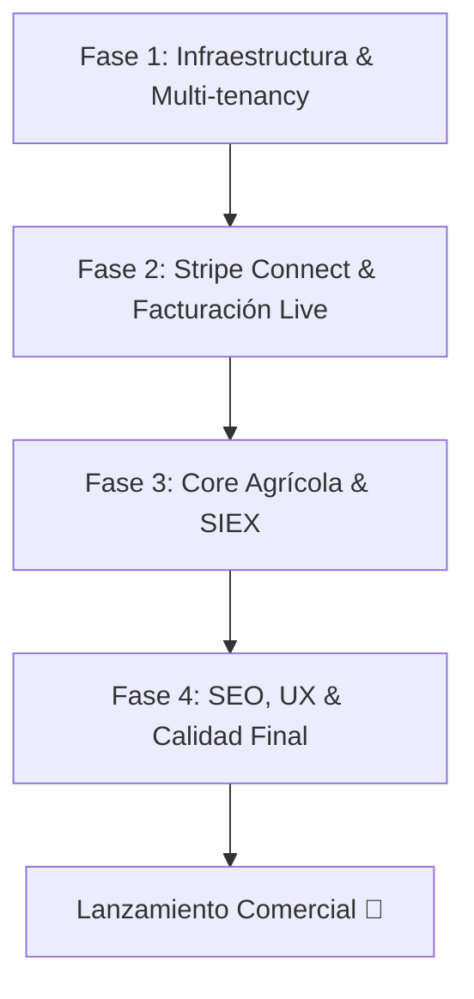

# Plan de Lanzamiento a Producción: InagroSolutions

Este documento establece la hoja de ruta definitiva con todas las tareas técnicas, de infraestructura y de negocio necesarias antes de desplegar el portal SaaS y la marca blanca de **InagroSolutions** en un entorno de producción real.

---

## 🗺️ Mapa de Ruta del Lanzamiento

---

## 🛠️ Fase 1: Infraestructura, DNS y Multi-tenancy Dinámico

Para permitir que cada partner (cooperativa, técnico, asesoría) tenga su propio portal personalizado con marca blanca y dominio propio, debemos habilitar los siguientes mecanismos:

### 1.1 Configuración de Redirección Wildcard (DNS)
*   **Estado Actual**: Mapeo y routing simulados en `src/proxy.ts`.
*   **Acción Necesaria**:
    *   Configurar un registro **CNAME Wildcard** (`*.inagrosolutions.com`) apuntando al servidor de producción (ej. Vercel o AWS).
    *   Habilitar la entrada wildcard en el panel del hosting para recibir todas las peticiones entrantes.
*   **Responsable**: DevOps / Administrador de Dominio.

### 1.2 Automatización de SSL para Dominios Personalizados
*   **Estado Actual**: No implementado.
*   **Acción Necesaria**:
    *   Configurar un webhook o proxy inverso (como Nginx con Let's Encrypt o el sistema automático de Vercel Domains API) para emitir certificados SSL seguros de forma automatizada cuando un partner añada su propio dominio (ej. `cuaderno.tucooperativa.com`).
*   **Responsable**: Ingeniero de Backend / DevOps.

### 1.3 Aislamiento de Datos por RLS en Supabase
*   **Estado Actual**: Políticas básicas configuradas en `schema_olivar_completo.sql`.
*   **Acción Necesaria**:
    *   Realizar una auditoría de seguridad exhaustiva de las políticas RLS.
    *   Garantizar bajo pruebas de penetración automáticas que un usuario perteneciente a la cooperativa **A** jamás pueda visualizar información de la cooperativa **B** modificando identificadores (`UUID`) en peticiones HTTP o manipulando los parámetros de las APIs.
*   **Responsable**: Database Administrator / Especialista en Seguridad.

---

## 💳 Fase 2: Stripe Connect y Flujo de Reparto Live

El motor de monetización compartida (50% partner / 50% plataforma) requiere pasar de Sandbox al entorno comercial real.

### 2.1 Sustitución de Claves de API de Stripe
*   **Estado Actual**: Claves en `.env.local` utilizan el prefijo de desarrollo (`sk_test_...` y `pk_test_...`).
*   **Acción Necesaria**:
    *   Reemplazar las credenciales por las claves de producción oficiales de Stripe Connect (`sk_live_...` y `pk_live_...`).
    *   Registrar el webhook de producción de Stripe en Supabase y actualizar `STRIPE_WEBHOOK_SECRET` con la clave Live.
*   **Responsable**: Backend / Finanzas.

### 2.2 Validación de Cuentas Conectadas (Express Accounts)
*   **Estado Actual**: Pruebas con cuentas ficticias.
*   **Acción Necesaria**:
    *   Configurar el formulario de onboarding de partners en producción para cumplir con las normativas KYC (Know Your Customer) y contra el blanqueo de capitales requeridas por Stripe en España y la Unión Europea.
*   **Responsable**: Legal / Backend.

---

## 🌾 Fase 3: Conexión SIEX Real y Lógica Agrícola

El núcleo regulatorio de la plataforma debe pasar de flujos simulados a conexiones e integraciones con las bases de datos de la administración española.

### 3.1 Integración Real del Vademécum del MAPA
*   **Estado Actual**: Búsquedas basadas en datos estáticos.
*   **Acción Necesaria**:
    *   Consolidar una rutina diaria de importación del catálogo oficial de productos fitosanitarios del **Ministerio de Agricultura, Pesca y Alimentación (MAPA)**.
    *   Implementar un panel visual en `/superadmin/vademecum` para subir el archivo CSV oficial, mostrando barra de progreso y posibles alertas.
*   **Responsable**: Backend Developer.

### 3.2 Canal Oficial SIEX (RD 1054/2022)
*   **Estado Actual**: Simulación en el frontend.
*   **Acción Necesaria**:
    *   Integrar los servicios web SOAP/REST ministeriales en los endpoints de `src/app/api/export/siex`.
    *   Configurar el sistema de firmas digitales delegadas por el agricultor a la entidad (o representante SIEX).
*   **Responsable**: Ingeniero de Integración / Especialista en Firmas Digitales.

### 3.3 Descuento de Stock en Almacén (Inventario)
*   **Estado Actual**: Formularios independientes.
*   **Acción Necesaria**:
    *   Crear un disparador (trigger) en Supabase o implementar lógica transaccional en las API actions de modo que, al registrar un tratamiento fitosanitario o fertilización, se descuente de forma automática el volumen consumido de la tabla `inventario`.
    *   Bloquear o alertar si el consumo excede el inventario disponible.
*   **Responsable**: Database Administrator / Frontend.

---

## 📈 Fase 4: SEO, UX y Calidad Final

Asegurar una experiencia sin fisuras para agricultores en campo y un excelente posicionamiento de marca blanca en buscadores.

### 4.1 Posicionamiento Web Dinámico (SEO por Cooperativa)
*   **Estado Actual**: Metadatos genéricos.
*   **Acción Necesaria**:
    *   Implementar la función `generateMetadata` de Next.js en la ruta dinámica `/c/[slug]/page.tsx`.
    *   Esto inyectará automáticamente en los buscadores (Google, Bing) y redes sociales el nombre de la cooperativa, su logotipo de marca blanca y la descripción personalizada.
    *   Configurar la generación automática del sitemap dinámico para los subdominios de los partners.
*   **Responsable**: Frontend / SEO Specialist.

### 4.2 Ajustes de Mobile-First (Uso en Campo)
*   **Estado Actual**: Diseños premium listos, pero susceptibles a mejoras en condiciones extremas de baja cobertura.
*   **Acción Necesaria**:
    *   Optimizar la compresión de imágenes al usar el escáner de facturas con la cámara del móvil en el campo.
    *   Garantizar el guardado temporal local (IndexedDB) para cuando el agricultor registre labores en zonas rurales sin señal telefónica, sincronizándose de forma automática una vez recupere cobertura.
*   **Responsable**: Frontend PWA Developer.

### 4.3 Limpieza y Cierre de Logs de Compilación
*   **Estado Actual**: Log de compilación actual al 100% limpio de TypeScript.
*   **Acción Necesaria**:
    *   Eliminar archivos de log huérfanos (`*.log`, `tsc_errors_new.txt`) del directorio raíz para mantener la higiene del repositorio antes del despliegue final.
*   **Responsable**: DevOps / QA.

---

## 📅 Matriz de Prioridad e Impacto

| Tarea | Prioridad | Esfuerzo | Impacto | Estado |
| :--- | :---: | :---: | :---: | :---: |
| **Configuración Wildcard DNS** | Alta | Medio | Crítico | ⏳ Pendiente |
| **Paso a Claves Live de Stripe** | Alta | Bajo | Crítico | ⏳ Pendiente |
| **Disparadores de Almacén/Inventario** | Media | Medio | Alto | ⏳ Pendiente |
| **SEO Dinámico por Partner** | Media | Bajo | Alto | ⏳ Pendiente |
| **Vademécum Oficial en Servidor** | Alta | Medio | Alto | ⏳ Pendiente |
| **Sincronización Offline (IndexedDB)** | Media | Alto | Medio | ⏳ Pendiente |
| **Limpieza de Repositorio** | Baja | Bajo | Bajo | ⏳ Pendiente |
