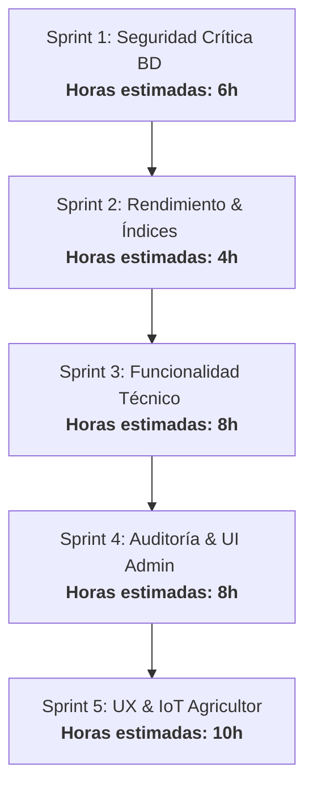

# 🔍 Auditoría de Estado e Implementación — InagroSolutions

Este informe presenta una revisión exhaustiva de la plataforma **InagroSolutions**, comparando el diseño del sistema con el código fuente y el esquema de base de datos actuales. El objetivo es identificar exactamente qué funcionalidades están operativas y qué brechas o tareas quedan pendientes para que todos los roles (**Superadmin**, **Admin/Tenant**, **Supervisor Técnico** y **Agricultor**) puedan desarrollar su labor tal y como fue diseñada.

---

## 🗺️ Mapa de Funcionalidad por Rol

A continuación se detalla la matriz de estado actual del desarrollo de las labores por cada tipo de usuario:

| Funcionalidad Diseñada | Superadmin | Admin (Tenant) | Supervisor Técnico | Agricultor (Farmer) | Estado de Implementación |
| :--- | :---: | :---: | :---: | :---: | :---: |
| **Monitoreo Global & KPIs** | ✅ | ❌ | ❌ | ❌ | **100% Operativo** |
| **Impersonación de Tenants** | ✅ | ❌ | ❌ | ❌ | **100% Operativo** (Vía cookies seguras) |
| **Gestión de Catálogo Fitosanitario (Vademécum)** | ✅ | ❌ | ❌ | ❌ | **100% Operativo** (Filtro por MAPA CSV) |
| **Branding & Marca Blanca** | ❌ | ✅ | ❌ | ❌ | **100% Operativo** |
| **Facturación & Stripe Connect (50% Split)** | ❌ | ✅ | ❌ | ❌ | **Listo para Go-Live** (Requiere credenciales comerciales) |
| **Asignación Técnico ↔ Agricultor** | ❌ | ✅ | ❌ | ❌ | **100% Operativo** |
| **Visualización Multi-Explotación (Asesores)** | ❌ | ⚠️ Parcial | ✅ | ❌ | **Operativo** (Dashboard técnico conectado a DB real) |
| **Emisión de Prescripciones Fitosanitarias** | ❌ | ❌ | ✅ | ❌ | **100% Operativo** |
| **Validación Formal de Cuadernos** | ❌ | ❌ | ⚠️ Sin UI | ❌ | **Base de Datos lista · UI Pendiente** |
| **Onboarding del Agricultor (4 pasos)** | ❌ | ❌ | ❌ | ✅ | **90% Operativo** (Detalle de `tenant_id` en creación) |
| **Asistente Virtual CDC (IA Fitosanitaria)** | ❌ | ❌ | ❌ | ✅ | **100% Operativo** (Dictado de voz y validación MAPA) |
| **Modo Offline PWA & IndexedDB** | ❌ | ❌ | ❌ | ✅ | **100% Operativo** (Encolamiento local y sincronización) |
| **Exportación Homologada SIEX (Excel/XML)** | ❌ | ❌ | ❌ | ✅ | **100% Operativo** (Lógica de servidor) |

---

## 👤 1. Superadmin (Dueño de la Plataforma)

El rol de **Superadmin** tiene control global sobre la infraestructura SaaS y la monitorización de todos los tenants y usuarios.

### 🟢 Lo que está 100% Operativo
*   **KPIs Globales Reales:** Visualiza en `/superadmin` el total de tenants, usuarios de la plataforma, explotaciones agregadas y cálculo dinámico de MRR real leyendo los planes asignados a los tenants de la base de datos (se resolvió la simulación hardcodeada).
*   **Impersonación de Tenants (SEC-7):** Permite cambiar al contexto de cualquier cooperativa partner usando una cookie segura (`x-impersonate-tenant`), lo que previene mutaciones erróneas o efectos secundarios en la base de datos.
*   **Gestión de Catálogo (Vademécum):** Drag & Drop visual en `/superadmin/vademecum` para subir e indexar masivamente en Supabase el CSV de productos fitosanitarios oficial del MAPA.
*   **Gestión de Usuarios y Planes:** Control total para modificar roles de plataforma y planes de Stripe.

### 🔴 Brechas y Mejoras Pendientes
*   **Eliminación Segura (Soft Delete) de Tenants (SEC-8):** Actualmente, `deleteTenant` ejecuta un borrado físico (`DELETE`) en cascada en Postgres. Se requiere migrar a un borrado lógico (`is_active = false`) para evitar pérdidas catastróficas accidentales de datos históricos de agricultores.
*   **Dashboard Financiero Integrado (SA-5):** No existe un panel para auditar las comisiones de Stripe Connect retenidas ni los flujos de cobro reales directamente en la interfaz (se debe ver en Stripe Dashboard externo).
*   **Configuración SMTP Global (SA-6):** La tabla `smtp_settings` no cuenta con columna `tenant_id`, actuando como configuración global compartida en lugar de tenant-isolated.

---

## 🏢 2. Admin (Administrador de Cooperativa / Tenant)

El **Admin** gestiona la marca blanca, sus técnicos y las altas de socios dentro de su cooperativa.

### 🟢 Lo que está 100% Operativo
*   **Dashboard Real de Red (DASH-1 a DASH-4):** KPIs de socios totales, hectáreas consolidadas de la red, alertas reales de los cuadernos de campo e índice de "Salud de Red" calculado en vivo basándose en compliance de alertas y tareas retrasadas.
*   **Consola de Marca Blanca:** Edición de logotipo, colores corporativos (para personalizar el portal público `/c/[slug]`), textos de cabecera y selección de módulos activos.
*   **Facturación B2B (Stripe Connect):** El flujo de comisiones compartidas al 50% entre InagroSolutions y la cooperativa está configurado. Redirección integrada al portal de facturación de Stripe.
*   **Asignaciones Técnicas:** Flujo interactivo en `/admin/assignments` para vincular de forma dinámica qué técnicos supervisan a qué agricultores.
*   **Workers & Machinery:** Vistas CRUD completas para operarios y registro de maquinaria de la entidad.

### 🔴 Brechas y Mejoras Pendientes
*   **Visualización de Auditoría Interna (ADM-4):** La tabla `audit_log` almacena todas las acciones críticas de los agricultores, pero los administradores de la cooperativa no disponen de una pantalla en su panel para auditar la actividad de su red.
*   **Visor readonly de Cuaderno de Socios (ADM-5):** El admin puede ver la lista de sus socios, pero carece de un acceso directo para auditar o imprimir el cuaderno digital en modo solo lectura de cada uno de ellos sin necesidad de impersonar.

---

## 🟢 3. Supervisor Técnico (Asesor Agrícola)

El **Técnico** supervisa las explotaciones asignadas, emite prescripciones y vela por el cumplimiento normativo.

### 🟢 Lo que está 100% Operativo
*   **Dashboard del Asesor:** Indicadores de agricultores asignados, hectáreas totales bajo tutela y feed de actividades agregado en tiempo real (tratamientos, labores y cosechas) de su cartera de clientes.
*   **Mis Clientes:** Ruta `/technician/farmers` con la lista de agricultores vinculados y enlace a su información de explotaciones.
*   **Prescripciones Fitosanitarias:** Emisión de recetas agrícolas asociando plagas y productos autorizados.

### 🔴 Brechas y Mejoras Pendientes
*   **Validación Formal de Cuadernos (UX-4):** La base de datos tiene la tabla `cuaderno_validaciones` diseñada para que el técnico firme y valide el cumplimiento regulatorio del agricultor, pero **no existe una UI en el panel técnico** para ejecutar esta acción de firma y aprobación.
*   **Tablero de Tareas Propias (UX-5):** Carece de una agenda agronómica o calendario de visitas exclusivo para que el técnico planifique sus labores directas con los agricultores.

---

## 🌱 4. Agricultor (Farmer)

El usuario final que opera el cuaderno y registra sus actividades diarias en el campo.

### 🟢 Lo que está 100% Operativo
*   **Cuaderno Digital (13 Módulos):** Panel interactivo con todas las labores del olivar (labores, fertilizaciones, fitosanitarios, parcelas, inventario de insumos, costes, cosechas, trazabilidad, sensores).
*   **Asistente Virtual CDC (IA):**
    *   *Dictado por Voz:* Extracción automática por IA de parcelas, dosis, productos y maquinaria a partir de notas de voz.
    *   *Validación MAPA al vuelo:* Integración con base de datos del Vademécum para alertar de productos no autorizados en el cultivo o dosificaciones peligrosas.
    *   *OCR Facturas:* Escaneo automatizado de facturas agrícolas para cargar stock en inventario.
*   **Automatizaciones SIEX:** Relleno de meteorología (temperatura y viento) automatizado mediante geolocalización y Open-Meteo.
*   **Trigger de Descuento de Stock:** Descuento atómico en inventario al registrar un tratamiento o fertilización.
*   **Offline Mode:** Registro en campo sin red y sincronización automática.
*   **Exportación SIEX Excel y XML:** Construcción de esquemas y descargas oficiales telemáticas en formato Excel y XML (RD 1054/2022).

### 🔴 Brechas y Mejoras Pendientes
*   **Persistencia de Tenant en Onboarding (UX-3):** Al registrar una nueva explotación en `/onboarding`, la base de datos no hereda el `tenant_id` en la tabla `explotaciones`, rompiendo el flujo multi-tenant en ese registro inicial si el agricultor viene a través de una landing de cooperativa (`/c/[slug]`).
*   **Integración IoT Física (SCALE-2):** El módulo de sensores acepta telemetría manual y geolocalización meteorológica, pero requiere conectar APIs de plataformas IoT físicas (como estaciones agroclimáticas locales) para la lectura de sondas automatizada.

---

## 🔒 5. Seguridad y Rendimiento de Base de Datos (Supabase)

El estado del motor de base de datos Postgres y políticas RLS revela fallos críticos que impiden un despliegue en producción con garantías multi-tenant:

### 🔴 Alertas de Seguridad Críticas (Fase 1)
1.  **Vista `resumen_diario` con SECURITY DEFINER (SEC-1):** Se ejecuta con los privilegios del creador de la vista, omitiendo RLS. Un usuario malintencionado podría realizar consultas cross-tenant. Debe migrarse a `SECURITY INVOKER`.
2.  **Tablas RLS sin Políticas Activas (SEC-2):** Las tablas `actividades_agricolas` and `parcelas_campana` tienen RLS activo pero cero políticas, bloqueando cualquier lectura/escritura telemática desde la aplicación.
3.  **Política permisiva en `cuaderno_validaciones` (SEC-3):** La política técnica tiene la condición `USING(true)`, dando visibilidad a todos los registros de validación de todos los tenants a cualquier usuario.
4.  **Funciones con `search_path` mutable (SEC-4):** Funciones clave (`get_auth_platform_role`, `is_superadmin`, `get_auth_tenant_id`, `audit_record_changes`, `check_user_access_parcela`) no tienen forzado el `SET search_path = ''`, abriendo riesgo a ataques de inyección de funciones en esquemas temporales.

### 🟡 Alertas de Rendimiento (Fase 2)
1.  **Foreign Keys sin Índices (PERF-1):** Existen más de **60 claves foráneas sin indexación**, destacando las relaciones en `tratamientos_fitosanitarios`, `labores`, `fertilizaciones`, `costes` y `cosechas`. Esto causará bloqueos lentos y caídas de rendimiento en búsquedas y borrados en cascada.
2.  **Uso Ineficiente de `auth.uid()` (PERF-2):** Múltiples políticas de RLS evalúan `auth.uid()` directamente en vez de usar la expresión en caché `(SELECT auth.uid())`, obligando a Postgres a recalcular la sesión para cada fila evaluada.

---

## 🚀 Plan de Acción Recomendado (Sprint a Sprint)

Para consolidar el lanzamiento definitivo de **InagroSolutions**, se propone abordar los trabajos pendientes en el siguiente orden:

### Sprint 1: 🛡️ Seguridad Crítica (Inmediato)
*   Reconstruir `resumen_diario` como `SECURITY INVOKER`.
*   Añadir políticas RLS correctas para `actividades_agricolas` y `parcelas_campana`.
*   Corregir la política de `cuaderno_validaciones` filtrando por `technician_id = auth.uid()`.
*   Inyectar `SET search_path = ''` en las funciones declaradas en base de datos.

### Sprint 2: ⚡ Rendimiento de Datos (Inmediato)
*   Ejecutar script de creación de índices en las 60+ FKs desprotegidas.
*   Actualizar las políticas RLS utilizando la query en caché `(SELECT auth.uid())`.

### Sprint 3: 🟢 Módulo de Supervisión Técnica (Prioridad Alta)
*   Desarrollar la pantalla de validación digital en el panel técnico para firmar los cuadernos de campo de los agricultores asignados.
*   Crear el calendario/tablero de tareas agrícolas para el visor del técnico.

### Sprint 4: 🏢 Transparencia del Tenant (Prioridad Media)
*   Crear la vista de Auditoría Interna en el panel de administrador para que la cooperativa visualice las modificaciones hechas por sus socios.
*   Diseñar el visor rápido readonly de los cuadernos de socios para el admin.

### Sprint 5: 📱 UX y Pulido del Agricultor (Prioridad Media)
*   Ajustar el flujo de `/onboarding` para que persista correctamente el `tenant_id` en la tabla `explotaciones`.
*   Refactorizar soft-delete en tenants para evitar borrado físico permanente.
