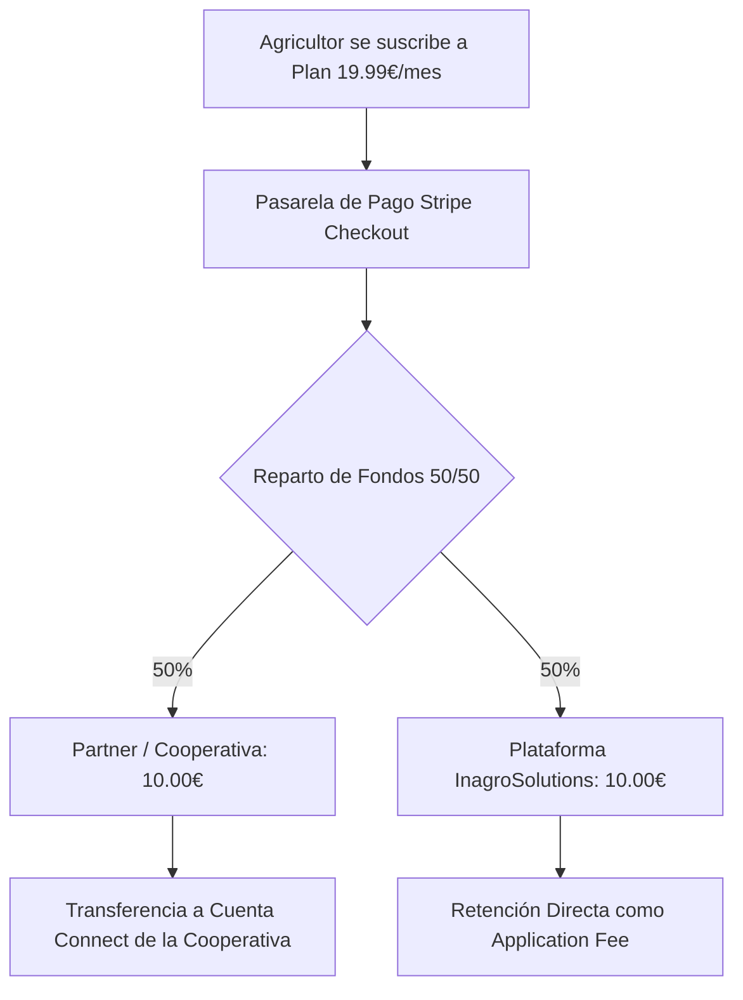

# 💳 Guía de Producción: Stripe Connect y Flujos de Facturación Live

Esta guía detalla el proceso paso a paso para configurar la pasarela de pago y la monetización compartida de **InagroSolutions** en un entorno de producción comercial real.

La plataforma utiliza **Stripe Connect Express** bajo un esquema de "Direct Charges" con una comisión de plataforma (*application fee*) del 50%. Esto permite que los partners cobren a sus agricultores y que la plataforma retenga automáticamente su comisión por licenciamiento y soporte en tiempo real.

---

## 🔑 1. Configuración de Claves de API de Stripe

Para pasar de Sandbox al entorno comercial real, debes sustituir las credenciales de desarrollo en tu servidor de producción (Vercel):

### Parámetros a configurar en el Panel de Variables de Entorno (Vercel):

```env
# Clave pública de Stripe (utilizada en el frontend para montar Stripe.js)
NEXT_PUBLIC_STRIPE_PUBLISHABLE_KEY="pk_live_VALOR_PUBLISHABLE_KEY"

# Clave secreta de Stripe (utilizada en las API actions del backend)
STRIPE_SECRET_KEY="sk_live_VALOR_SECRET_KEY"
```

> [!WARNING]
> Asegúrate de que las claves de producción comiencen con el prefijo `pk_live_` y `sk_live_`. Si usas claves `_test_` en producción, los pagos reales serán rechazados y las tarjetas de crédito comerciales no serán procesadas.

---

## 🪝 2. Configuración de Webhooks en Producción

El backend de InagroSolutions cuenta con un receptor unificado de webhooks en `/api/stripe/webhook` que procesa de manera segura las actualizaciones de suscripciones de agricultores y el estado KYC de las cooperativas. 

En producción, **debes configurar dos webhooks distintos en tu panel de Stripe** para garantizar la correcta recepción de eventos:

### A. Webhook Principal (Suscripciones y Pagos)
1. Accede a tu dashboard de Stripe, ve a **Developers** > **Webhooks**.
2. Pulsa en **Add endpoint** y añade la siguiente URL:
   `https://inagrosolutions.com/api/stripe/webhook`
3. En **Select events**, selecciona los siguientes eventos:
   *   `checkout.session.completed` (Alta y activación de planes)
   *   `invoice.payment_succeeded` (Renovación de planes)
   *   `invoice.payment_failed` (Fallos en el cobro)
   *   `customer.subscription.deleted` (Cancelaciones de planes)
   *   `customer.subscription.updated` (Upgrades / Downgrades)
4. Guarda el endpoint y copia el **Signing secret** (comienza por `whsec_...`).
5. Configúralo en Vercel bajo el nombre:
   `STRIPE_WEBHOOK_SECRET="whsec_xxxxxxxxxxxx"`

### B. Webhook de Connect (KYC de Cooperativas)
1. En el mismo panel de Webhooks, pulsa en **Add endpoint**.
2. **IMPORTANTE**: Activa la casilla **Listen to events on Connected accounts** (o añade el webhook dentro de la sección Connect).
3. Añade la misma URL del receptor:
   `https://inagrosolutions.com/api/stripe/webhook`
4. En **Select events**, selecciona únicamente el evento:
   *   `account.updated`
5. Guarda el endpoint y copia su **Signing secret**.
6. Configúralo en Vercel bajo el nombre:
   `STRIPE_CONNECT_WEBHOOK_SECRET="whsec_connect_xxxxxxxxxxxx"`

> [!TIP]
> Nuestro middleware descodifica dinámicamente los payloads utilizando la firma correspondiente a cada webhook. Esto garantiza que la actualización del estado fiscal del partner se ejecute de forma aislada y ultra-segura.

---

## 🇪🇸 3. Normativa KYC y Configuración del Onboarding en España (UE)

Stripe Connect Express requiere el cumplimiento de estrictas normativas contra el blanqueo de capitales (AML) y normativas KYC (Know Your Customer) aplicadas por el Banco de España y la Unión Europea. 

### Configuración en el Dashboard de Stripe (Capa Connect)
Para asegurar que las cooperativas y partners españoles puedan registrarse sin fricciones, configura los siguientes parámetros en la consola de administración de Stripe:

1. **Configuración de la Cuenta**:
   *   Establece el país de la plataforma como **España**.
   *   Moneda por defecto: **EUR (€)**.
2. **Capacidades Connect (Capabilities)**:
   *   Asegúrate de marcar como solicitadas y activas por defecto las capacidades de **Card Payments** (Procesamiento de tarjetas) y **Transfers** (Transferencias y liquidación de fondos).
3. **onboarding Express**:
   *   En la sección de Branding de Connect, sube el logotipo de tu marca e introduce el nombre público de la plataforma. Este branding aparecerá en el formulario nativo y seguro de Stripe cuando un partner inicie su onboarding.
   *   Stripe solicitará de forma nativa a la cooperativa española:
       *   **CIF/NIF de la empresa** (`tax_id`).
       *   **Dirección fiscal** en España.
       *   **Identificación del representante legal** (Nombre, apellidos, fecha de nacimiento y DNI/NIE).
       *   **Cuenta Bancaria (IBAN)** para las liquidaciones semanales automatizadas.

---

## 💸 4. Flujo de Monetización Dinámica y Reparto 50/50

El flujo de caja de la plataforma está diseñado para repartir atómicamente el importe de los planes cobrados al agricultor:



### Sincronización en Base de Datos (Supabase)
Cuando un pago se completa con éxito, el webhook registra la transacción en la tabla `payment_transactions`:
- `amount_total`: Importe íntegro pagado por el agricultor (ej. 1999 céntimos).
- `amount_platform`: Retención del 50% correspondiente a la plataforma (ej. 1000 céntimos).
- `amount_tenant`: Liquidación del 50% transferida al partner de marca blanca (ej. 999 céntimos).

Las cooperativas e InagroSolutions recibirán facturas mensuales consolidadas que documentarán estos movimientos de licenciamiento de marca blanca de acuerdo con el marco regulatorio tributario en España.
