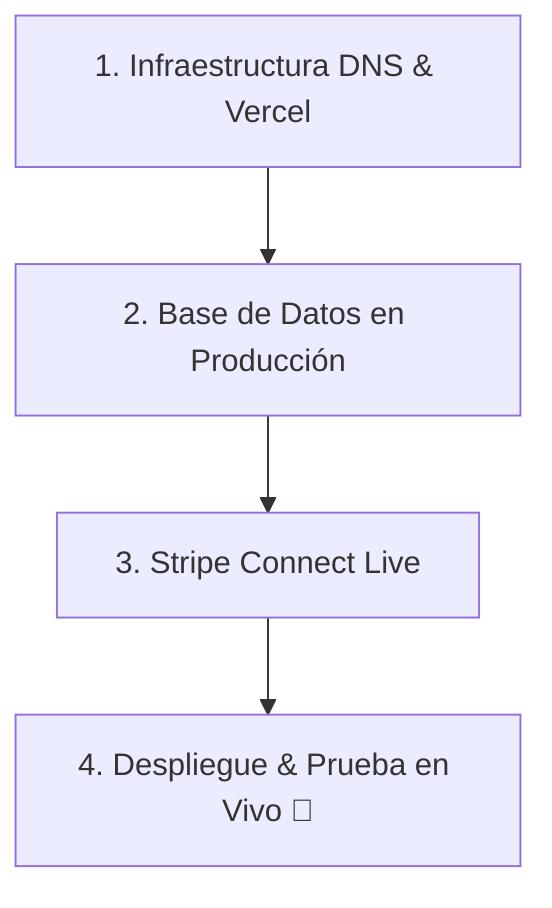

# Plan de Lanzamiento Definitivo: Últimos Retoques Operativos

Este documento establece el plan operativo paso a paso necesario para realizar la transición del software de **InagroSolutions** desde el entorno local de desarrollo al entorno comercial real en producción.

---

## 🗺️ Índice del Plan Operativo



---

## 🌐 1. Configuración de DNS y Multi-tenancy en Vercel

Para permitir que el sistema resuelva los subdominios de los partners (`partner.inagrosolutions.com`) y permita dominios personalizados (como `cuaderno.cooperativa.com`), sigue estos pasos:

### Paso 1.1: Configurar el CNAME Wildcard en tu Proveedor de Dominio
1. Inicia sesión en el registrador donde compraste el dominio `inagrosolutions.com` (ej. Nominalia, GoDaddy, Cloudflare, etc.).
2. Accede a la sección de **Gestión de Zona DNS**.
3. Añade un nuevo registro con la siguiente configuración:
   - **Tipo**: `CNAME`
   - **Nombre / Host**: `*`
   - **Valor / Destino**: `cname.vercel-dns.com.` *(Asegúrate de incluir el punto final si el proveedor lo requiere)*.
   - **TTL**: Auto o el mínimo permitido (ej. 1 hora).

### Paso 1.2: Registrar el Wildcard en Vercel
1. Abre tu panel de control de **Vercel** y selecciona el proyecto `inagrosolutions`.
2. Ve a la pestaña **Settings** (Configuración) > **Domains** (Dominios).
3. Escribe `*.inagrosolutions.com` en la caja de texto y pulsa **Add**.
4. Vercel te indicará si requiere verificar la propiedad del dominio principal. Si es así, te proporcionará un registro `TXT` (con un host como `_vercel` y un valor largo). Añade este registro en la zona DNS de tu proveedor.
5. Una vez validado, Vercel aprovisionará automáticamente un certificado SSL wildcard (Let's Encrypt) que protegerá todas las conexiones de tus cooperativas de forma segura.

### Paso 1.3: Credenciales de la API de Vercel para Dominios Personalizados
Para que la funcionalidad de dominios propios de cooperativas funcione automáticamente, el servidor necesita comunicarse con Vercel:
1. Ve a la configuración de tu cuenta personal o de equipo en Vercel y genera un **Personal Access Token** (Token de Acceso Personal).
2. Copia este token y añádelo en las variables de entorno del panel de Vercel del proyecto con el nombre:
   - `VERCEL_TOKEN`
3. Copia el identificador de tu proyecto en la pestaña *General* de la configuración de Vercel y añádelo como variable de entorno:
   - `VERCEL_PROJECT_ID`

---

## 🗃️ 2. Base de Datos Supabase de Producción

Debemos preparar la base de datos real donde se almacenarán las explotaciones, labores e inventarios de los agricultores.

### Paso 2.1: Migrar el Esquema de Tablas
1. Entra a tu proyecto de producción en el panel de **Supabase**.
2. Dirígete al **SQL Editor**.
3. Ejecuta el archivo de migración consolidado de tu esquema de datos. Asegúrate de incluir:
   - La estructura de usuarios, explotaciones, parcelas, tratamientos y fertilizaciones.
   - Las tablas de inventario (`inventario_insumos`).
   - Las tablas para el vademécum (`productos_fitosanitarios`).
   - Las tablas y columnas para marcas de tenant y subdominios (`num_registro_siex` en `explotaciones`, etc.).

### Paso 2.2: Implementar el Trigger Atómico de Stock
Ejecuta el disparador SQL en la base de datos de producción para garantizar que no se puedan insertar tratamientos sin suficiente stock en el inventario real:
```sql
CREATE OR REPLACE FUNCTION public.fn_deduct_inventory_stock()
RETURNS TRIGGER AS $$
DECLARE
  v_stock_actual NUMERIC;
  v_consumo NUMERIC;
  v_factor_conversion NUMERIC;
  v_superficie NUMERIC;
BEGIN
  -- Lógica atómica de deducción de stock
  -- ... (ejecutar la migración correspondiente del trigger en Supabase)
  RETURN NEW;
END;
$$ LANGUAGE plpgsql SECURITY DEFINER;
```

### Paso 2.3: Auditar e Iniciar Políticas RLS (Seguridad)
> [!WARNING]
> Nunca lances el portal a producción con tablas públicas desprotegidas. RLS es tu único escudo contra filtraciones entre cooperativas.

1. En el panel de Supabase, navega a **Database** > **Replication** / **Policies**.
2. Asegúrate de que todas las tablas tengan el **Row Level Security (RLS)** activado (`ALTER TABLE ... ENABLE ROW LEVEL SECURITY;`).
3. Comprueba que las políticas creadas para cooperativas utilicen el `tenant_id` o `explotacion_id` cruzado con el perfil de usuario autenticado.

---

## 💳 3. Pasarela de Pagos Stripe Connect Live

Para pasar de pagos de prueba a cobrar dinero real y repartirlo con las cooperativas partners:

### Paso 3.1: Configurar Claves de Producción comerciales
1. Entra a tu panel de **Stripe** y desactiva el interruptor *Test Mode* (Modo de Prueba).
2. Ve a **Developers** > **API Keys** y copia las claves en vivo:
   - **Secret Key**: `sk_live_...`
   - **Publishable Key**: `pk_live_...`
3. En el panel de **Vercel** de tu proyecto, actualiza las variables de entorno de producción:
   - `STRIPE_SECRET_KEY` ➔ `sk_live_...`
   - `NEXT_PUBLIC_STRIPE_PUBLISHABLE_KEY` ➔ `pk_live_...`

### Paso 3.2: Configurar el Webhook Connect en Producción
Para que la plataforma se entere cuando se realiza un pago exitoso y active las suscripciones o créditos:
1. En el panel de Stripe de producción, navega a **Developers** > **Webhooks**.
2. Haz clic en **Add Endpoint** (Añadir Destino) y configura:
   - **Endpoint URL**: `https://inagrosolutions.com/api/stripe/webhook`
   - **Listen to**: Selecciona "Listen to events on Connected accounts" (Escuchar eventos en cuentas conectadas).
   - **Events**: Añade los eventos `checkout.session.completed` y `charge.refunded`.
3. Copia el **Signing Secret** (Secreto de Firma del Webhook) que empieza por `whsec_...`.
4. Configúralo en la variable de entorno de Vercel:
   - `STRIPE_WEBHOOK_SECRET` ➔ `whsec_...`

### Paso 3.3: Configurar Stripe Connect y KYC Corporativo
1. Rellena el perfil de plataforma de Stripe Connect en producción con los datos fiscales legales de InagroSolutions.
2. Define la marca y el diseño del onboarding Express (logotipo de plataforma, colores primarios).
3. Configura los términos y condiciones de uso comercial del reparto de ingresos (reparto 50/50 fijado).

---

## 🚀 4. Despliegue Final y Validación en Vivo

### Paso 4.1: Promoción del Código a Main
1. Asegúrate de hacer commit de todos tus cambios locales confirmados.
2. Sube la rama de desarrollo unificada a la rama `main` en tu repositorio remoto:
   ```bash
   git checkout main
   git merge dev
   git push origin main
   ```
3. Vercel detectará el commit en `main` y comenzará de forma automática el build de producción optimizado utilizando las variables de entorno reales configuradas en los pasos previos.

### Paso 4.2: Prueba del Circuito Transaccional Real (Go-Live Test)
> [!IMPORTANT]
> Nunca asumas que todo funciona hasta haber realizado una compra real en el entorno vivo con una tarjeta de crédito de verdad.

Sigue este protocolo de validación:
1. **Configurar Precio Temporal**: En tu base de datos de producción, edita temporalmente un plan para que tenga un coste simbólico de **1,00 €** (el mínimo permitido por Stripe es de 0,50 €).
2. **Onboarding del Partner Piloto**:
   - Accede a `https://inagrosolutions.com/partner/signup`.
   - Crea una cuenta de cooperativa partner real.
   - Inicia el flujo de Stripe Connect y completa el onboarding Express con datos de producción reales de la cooperativa piloto (identificación, cuenta bancaria para cobrar).
3. **Registro de Agricultor**:
   - Ve al portal personalizado de la cooperativa creada (ej. `https://coop-piloto.inagrosolutions.com/signup`).
   - Regístrate como agricultor de prueba.
4. **Pago Real**:
   - Ve a la sección de planes de suscripción y selecciona el plan de 1,00 €.
   - Introduce una tarjeta de crédito real y completa el pago de 1,00 € de forma segura.
5. **Auditoría de Fondos**:
   - Entra al panel de Stripe de InagroSolutions (plataforma principal) en modo Live.
   - Comprueba en *Payments* que se ha procesado el pago de 1,00 €.
   - Ve a la sección de *Transfers* o *Connect* y valida que **0,50 €** han sido transferidos de manera instantánea y automática a la cuenta conectada del partner piloto, y los otros **0,50 €** han quedado en la cuenta de InagroSolutions.
6. **Verificación de Activación**:
   - Regresa al portal del agricultor y verifica que la cuenta se haya activado al instante y que los créditos e histórico de la suscripción aparezcan correctamente gracias a la respuesta automática del Webhook.
7. **Revertir Precio**: Una vez confirmada la fluidez del circuito comercial, restaura el precio original del plan de suscripción en tu base de datos de producción.
