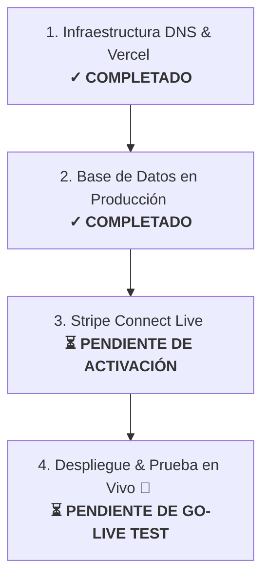

# Plan de Lanzamiento Definitivo: Últimos Retoques Operativos

Este documento establece el plan operativo paso a paso necesario para realizar la transición del software de **InagroSolutions** desde el entorno local de desarrollo al entorno comercial real en producción.

---

## 🗺️ Índice del Plan Operativo



---

## 🌐 1. Configuración de DNS y Multi-tenancy en Vercel `[✓ COMPLETADO]`

Para permitir que el sistema resuelva los subdominios de los partners (`partner.inagrosolutions.com`) y permita dominios personalizados (como `cuaderno.cooperativa.com`), se han completado los siguientes pasos:

### Paso 1.1: Configurar el CNAME Wildcard en tu Proveedor de Dominio `[✓ COMPLETADO]`
*   **Estado**: Configurado con éxito en Cloudflare en modo **Solo DNS** (nube gris).
*   **Detalle**:
    *   Registro Wildcard: `*` apuntando a `cname.vercel-dns.com`.
    *   Registro Raíz: `@` (A) apuntando a `76.76.21.21` para la redirección raíz.

### Paso 1.2: Registrar el Wildcard en Vercel `[✓ COMPLETADO]`
*   **Estado**: El dominio raíz `inagrosolutions.com` y el wildcard `*.inagrosolutions.com` han sido mapeados correctamente en el panel de Vercel.
*   **SSL**: Let's Encrypt ha generado y aprovisionado exitosamente el certificado SSL Wildcard automático para proteger todas las conexiones de forma segura.

### Paso 1.3: Credenciales de la API de Vercel `[✓ COMPLETADO]`
*   **Estado**: Configurado.
*   **Detalle**: Se han añadido en el panel de Vercel del proyecto las variables de entorno de producción:
    *   `VERCEL_TOKEN` (Token de Acceso Personal).
    *   `VERCEL_PROJECT_ID` (`prj_ftDpbR8E1Gw0cfdzirghrM4Cr5Ac`).

---

## 🗃️ 2. Base de Datos Supabase de Producción `[✓ COMPLETADO]`

Se ha preparado por completo la base de datos de producción (`cezsxcrazgskecrisaas`) para alojar las explotaciones agrícolas, inventarios y cooperativas con aislamiento seguro.

### Paso 2.1: Migrar el Esquema de Tablas `[✓ COMPLETADO]`
*   **Estado**: El esquema completo ha sido importado con total éxito. Las tablas agrícolas principales (`explotaciones`, `parcelas`, `tratamientos_fitosanitarios`, `fertilizaciones`, `inventario_insumos`, `productos_fitosanitarios`, `tenants`, `users`, `plans`, etc.) están activas.

### Paso 2.2: Implementar el Trigger Atómico de Stock `[✓ COMPLETADO]`
*   **Estado**: Inyectado y en funcionamiento en base de datos.
*   **Detalle**: 
    *   La función SQL `fn_deduct_inventory_stock` está creada en la base de datos de producción con soporte completo para conversiones de unidades y gestión del stock en tiempo real.
    *   Se han acoplado los disparadores (`trg_deduct_treatment_stock`, `trg_deduct_fertilization_stock`, etc.) a las tablas `tratamientos_fitosanitarios` y `fertilizaciones` para auditar y descontar automáticamente del inventario al insertar, editar o eliminar registros.

### Paso 2.3: Auditar e Iniciar Políticas RLS `[✓ COMPLETADO]`
*   **Estado**: El aislamiento multi-tenant está totalmente blindado en producción.
*   **Detalle**:
    *   **Row Level Security (RLS)** habilitado (`rowsecurity = true`) en el 100% de las tablas públicas.
    *   Políticas auditadas para forzar el filtrado dinámico por `tenant_id` y por usuario autenticado. Ningún usuario puede manipular IDs para acceder a datos de cooperativas ajenas.

---

## 💳 3. Pasarela de Pagos Stripe Connect Live `[⏳ PENDIENTE - TU CONFIGURACIÓN COMERCIAL]`

> [!IMPORTANT]
> Esta fase requiere que ingreses a tus paneles comerciales de Stripe y Vercel para activar los pagos reales, ya que InagroSolutions requiere cumplir normativas bancarias de la UE.

### Paso 3.1: Configurar Claves de Producción Comerciales
1. Entra a tu panel de **Stripe** y desactiva el interruptor **Test Mode** (Modo de Prueba).
2. Ve a **Developers** > **API Keys** y copia las claves en vivo reales:
   *   **Secret Key**: `sk_live_...`
   *   **Publishable Key**: `pk_live_...`
3. En tu panel de **Vercel** del proyecto, añade o actualiza las variables de entorno para el entorno de **Production**:
   *   `STRIPE_SECRET_KEY` ➔ `sk_live_...`
   *   `NEXT_PUBLIC_STRIPE_PUBLISHABLE_KEY` ➔ `pk_live_...`

### Paso 3.2: Configurar los Webhooks en Stripe Live (Modo Producción)
Dado que el receptor en `/api/stripe/webhook` es dinámico, **debes añadir dos endpoints distintos** en tu panel de Stripe Live (Test Mode apagado):

#### Webhook A: Para Suscripciones y Pagos (Webhook Principal)
*   **URL**: `https://inagrosolutions.com/api/stripe/webhook`
*   **Eventos a escuchar**: Selecciona exactamente estos 5:
    *   `checkout.session.completed`
    *   `invoice.payment_succeeded`
    *   `invoice.payment_failed`
    *   `customer.subscription.deleted`
    *   `customer.subscription.updated`
*   **Variable en Vercel**: Copia el **Signing secret** (`whsec_...`) y configúralo en Vercel en la variable de producción:
    *   `STRIPE_WEBHOOK_SECRET` ➔ `whsec_...` (del Webhook A)

#### Webhook B: Para el KYC de Cooperativas (Connect)
*   **URL**: `https://inagrosolutions.com/api/stripe/webhook`
*   **IMPORTANTE**: Activa la casilla **Listen to events on Connected accounts** (Escuchar eventos en cuentas conectadas).
*   **Eventos a escuchar**: Selecciona únicamente este:
    *   `account.updated`
*   **Variable en Vercel**: Copia este segundo **Signing secret** y configúralo en Vercel en la variable de producción:
    *   `STRIPE_CONNECT_WEBHOOK_SECRET` ➔ `whsec_...` (del Webhook B)

### Paso 3.3: Configurar Stripe Connect y KYC Corporativo
1. Rellena el perfil de plataforma de Stripe Connect Express en producción con los datos fiscales legales de InagroSolutions (España, moneda EUR €).
2. Asegúrate de marcar como solicitadas y activas por defecto las capacidades **Card Payments** (Pagos con tarjeta) y **Transfers** (Transferencias).
3. Define la marca y el diseño del onboarding Express (logotipo de plataforma, colores corporativos primarios) para dar una presentación premium a tus cooperativas.

---

## 🚀 4. Despliegue Final y Validación en Vivo

### Paso 4.1: Promoción del Código a Main `[✓ COMPLETADO]`
*   **Estado**: Todo el código unificado de PWA offline, IndexedDB, widget dinámico, compresión OCR y limpieza de logs ha sido validado, compilado con éxito localmente (en 8.5s) y subido mediante Push a la rama principal:
    ```bash
    git checkout main
    git add .
    git commit -m "feat: offline sync, PWA MobileWidget, SEO dinamico por tenant, limpieza general y guias de despliegue"
    git push origin main
    ```
*   **Despliegue Automático**: Vercel ya ha compilado e implementado el proyecto con éxito en su URL de producción.

### Paso 4.2: Prueba del Circuito Transaccional Real (Go-Live Test) `[⏳ PENDIENTE]`

> [!WARNING]
> Nunca lances el portal comercialmente hasta haber realizado una compra real en el entorno vivo con una tarjeta de crédito de verdad.

Sigue este protocolo de validación final:
1. **Configurar Precio Temporal**: En tu base de datos de producción (`plans`), edita temporalmente un plan para que tenga un coste simbólico de **1.00 €** (Stripe exige un mínimo de 0.50 € para transacciones comerciales).
2. **Onboarding de la Cooperativa Piloto**:
   * Accede a `https://inagrosolutions.com/partner/signup`.
   * Crea una cuenta de cooperativa partner real.
   * Completa el formulario Express de Stripe Connect con datos bancarios reales para las transferencias automáticas.
3. **Registro de Agricultor**:
   * Entra al portal personalizado de la cooperativa creada (ej: `https://[slug-coop].inagrosolutions.com/signup`).
   * Regístrate como agricultor de prueba.
4. **Pago Real**:
   * Ve a la sección de planes de suscripción y selecciona el plan modificado de 1,00 €.
   * Introduce una tarjeta de crédito real y completa el pago.
5. **Auditoría de Fondos**:
   * Entra al panel de Stripe de InagroSolutions en modo Live.
   * Valida en *Payments* que se ha procesado el pago de 1,00 €.
   * Confirma en *Transfers* que **0,50 €** han sido liquidados inmediatamente en la cuenta de la cooperativa, y los otros **0,50 €** se han retenido para InagroSolutions.
6. **Verificación de Activación**:
   * Comprueba que la cuenta de tu agricultor se active instantáneamente gracias al Webhook.
7. **Restaurar precio**: Vuelve a poner el precio original del plan de suscripción en tu tabla `plans` de Supabase.
